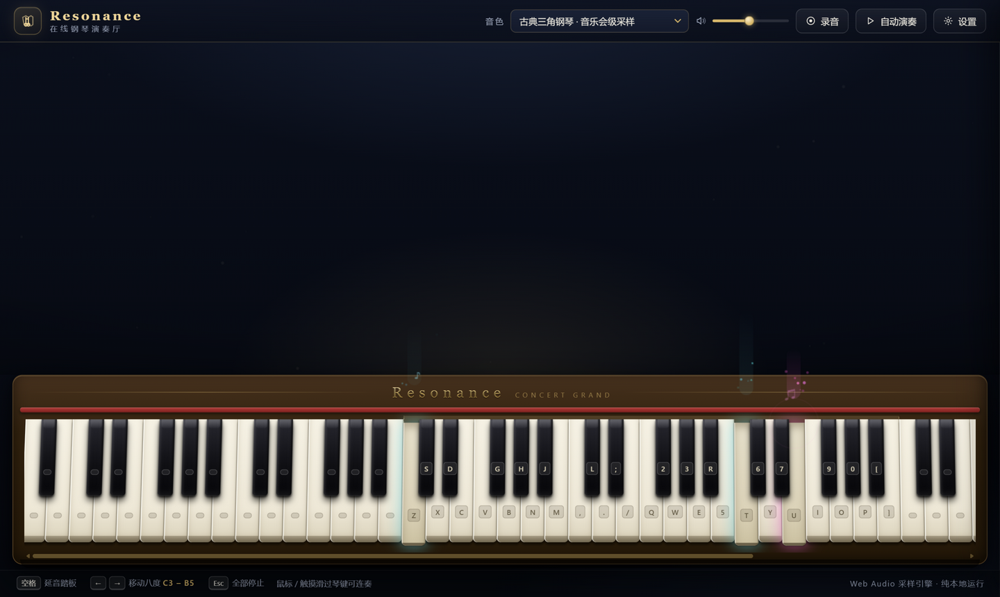

# Resonance · 在线钢琴演奏厅 🎹

> 在浏览器里演奏一架三角钢琴 —— 多音色采样引擎、真实复音与延音、键位自定义、录音回放、自动演奏（假弹）。
>
> **An online piano performance hall in your browser.** Multi-timbre sampled piano, true polyphony & sustain, custom key bindings, recording, and auto-play.



纯前端项目：**无框架、无构建、无后端**，克隆即用，也可以直接部署到 GitHub Pages / Vercel / Netlify 等任意静态托管。

---

## ✨ 功能特性

- 🎹 **88 键完整钢琴**：A0–C8 全键渲染，拟真木质琴体、红毡、3D 立体琴键与按压动效
- 🎼 **5 种音色切换**：古典三角钢琴（MusyngKite 采样）／明亮立式钢琴／复古电钢琴（Rhodes）／酒馆钢琴／内置梦幻合成音色（离线秒开）
- 🔊 **真实演奏体验**：
  - Web Audio 采样引擎，52 复音上限 + 智能偷音，快速连奏不打架、不爆音
  - 同音重击自然止音、低音偏左高音偏右的声像定位、程序生成音乐厅卷积混响
  - **延音踏板**（空格）：松键后延音，抬踏板统一止音，支持踏板锁定
- ⌨️ **三套键位方案 + 任意重绑**：标准三组音（LMMS/MPP 风格半音连续）／紧凑两组音／简易白键；设置里点「更换」按新键即可重绑，`←` `→` 整体移八度
- 🖱️ **鼠标 / 触摸可演奏**：按下发音，横向滑动刮奏（glissando），按键越靠下力度越大
- 🎛️ **MIDI 键盘支持**：Chrome / Edge 下插入 USB MIDI 键盘即插即用，力度、延音踏板（CC64）全支持
- 🎆 **梦幻按键特效**：辉光光束、柔光火花、四芒星、上升光球、涟漪与漂浮音符，背景散景光斑，音高对应色相，可开关、可调强度
- ⏺️ **录音回放**：一键录制你的演奏并回放
- ▶️ **自动演奏 / 假弹**：
  - 自动播放内置乐曲，琴键自动跳动
  - **按键跟随（假弹）模式**：不会弹琴？随便敲键盘，乐曲就跟着你的敲击节奏推进，人人都能"弹"一首歌
- 📥 **MIDI / EOP 文件导入**：把任意 `.mid` 或人人钢琴 `.eop` 文件导入「自动演奏」面板即可演奏——自动跟随曲速变化、跳过鼓轨、整体移调适配钢琴音域
- 🎵 **内置乐曲**：黄霄云《星辰大海》、《左手指月》（萨顶顶词曲/黄霄云翻唱，EveryonePiano 社区转录精确版）、致爱丽丝、欢乐颂、卡农、小星星

## 🚀 快速开始

### Windows 一键启动（推荐）

| 脚本 | 说明 |
| --- | --- |
| `启动钢琴.bat` | 双击即用默认浏览器打开（纯本地运行，无需任何环境） |
| `start_server.bat` | 启动本地服务器（自动检测 Python / Node.js）并打开 `http://127.0.0.1:8613` |

> 两个脚本都只需双击；若浏览器提示不安全，点击「仍要运行」即可。

### 其他系统 / 手动启动

任选其一：

```bash
# Python
python -m http.server 8613

# Node.js（零依赖内置服务器）
node scripts/tiny-server.js 8613
```

然后访问 `http://127.0.0.1:8613`。

> 💡 本项目没有使用任何 `fetch` 请求，理论上直接双击 `index.html`（file:// 协议）也能运行；
> 但部分浏览器会限制 file:// 下的动态脚本加载，遇到音色加载失败时请改用上面的服务器方式。

### 部署到线上

整个仓库就是一个静态站点，直接部署即可：

- **GitHub Pages**：仓库 Settings → Pages → 选择 `main` 分支 / 根目录
- **Vercel / Netlify / Cloudflare Pages**：导入仓库，无需任何构建配置

## 🎹 演奏指南

默认键位「标准 · 三组音」（与 LMMS / Multiplayer Piano 风格一致，半音连续覆盖 C3–B5）：

```
黑键:  S   D     G   H   J       L   ;        2   3     5   6   7     9   0
白键:  Z   X   C   V   B   N   M   ,   .   /  Q   W   E   R   T   Y   U   I   O   P   [   ]
音名:  C3 C#3  D3 D#3  E3  F3 F#3 G3 G#3 A3 A#3  B3  C4 C#4 D4 D#4 E4  F4 F#4 G4 G#4 A4 A#4
       C5 C#5  D5 D#5  E5  F5 F#5 G5 G#5 A5 A#5  B5
```

| 按键 | 功能 |
| --- | --- |
| 字母 / 数字键 | 演奏（按所选键位方案映射） |
| `空格` | 延音踏板（按住生效） |
| `←` / `→` | 整体移动八度（C3–B5 → C4–B6 …） |
| `Esc` | 急停：停止所有声音 / 录音回放 / 自动演奏 |

鼠标或手指：按琴键发音，按住横向滑动可刮奏；按点越靠近琴键外沿力度越大。

## 🎛️ 设置面板

- **声音**：音色切换、主音量、大厅混响量、延音踏板锁定
- **显示**：键盘按键标签、音名标签（C4…）、粒子特效开关与强度
- **键位**：三套预设方案、逐键重绑（点「更换」后按新键）、恢复默认

所有设置自动保存在浏览器本地（localStorage），下次打开自动恢复。

## 🎼 录音与自动演奏

- **录音**：顶栏「录音」→ 开始录音 → 演奏 → 停止 → 播放回放
- **自动演奏**：顶栏「自动演奏」→ 选曲 → 两种模式：
  - *自动播放*：按时值自动演奏整首乐曲
  - *按键跟随（假弹）*：开始后**随便敲键盘**，乐曲会按你敲击的节奏逐音推进 —— 把键盘当成节拍器，人人都能"演奏"一首《星辰大海》
- **导入 MIDI / EOP**：点「导入 MIDI」选择本地 `.mid` 或 `.eop` 文件（导入后出现在曲目下拉框中）。MIDI 支持 format 0/1、曲速变化（tempo 事件）、running status、SMPTE 时基；EOP 支持 v200/v201/v301 布局。自动跳过 GM 鼓轨（第 10 通道）、自动整体移调适配 88 键音域。导入后「自动播放」和「按键跟随」都可用

## 🔍 曲谱与 MIDI 资源是怎么找到的

本项目的准确曲谱与文件来源（均为公开渠道，按可靠程度排序）：

| 来源 | 地址 | 说明 |
| --- | --- | --- |
| **EveryonePiano 曲库数据库** | [hsdllcw/everyonepiano-music-database](https://github.com/hsdllcw/everyonepiano-music-database) | GitHub 开源仓库，收录人人钢琴网 **4.5 万+ 社区转录 .eop 文件**（免费直接下载），内置的《星辰大海》《左手指月》精确数据即出自这里 |
| **EOP 文件格式规范** | [emizuki/eop2midi](https://github.com/emizuki/eop2midi) | 逆向出的 EOP（v200/v201/v301）二进制格式规范与 Go 转换器，本站的 .eop 导入功能据此用 JS 重新实现 |
| **人人钢琴网** | [everyonepiano.cn](https://www.everyonepiano.cn/) | 中文流行钢琴曲库最全的站点；.eopn/.eopm 免登录下载，**.mid 需注册免费账号**（如《星辰大海》编号 12650） |
| **MuseScore** | [musescore.com](https://musescore.com/) | 社区五线谱（如[星辰大海钢琴版](https://musescore.com/user/11147046/scores/6644403)），可导出 MIDI，需账号且部分格式限 Pro |
| **BitMidi** | [bitmidi.com](https://bitmidi.com/) | 免费直链 MIDI 库，英文/动漫曲丰富，中文流行较少 |

> 找不到现成 MIDI 时也可以像本站早期版本一样从简谱/五线谱图片人工转谱，但准确度依赖转谱者；
> 社区转录的 .eop/.mid 由大量玩家演奏验证过，节奏与音符可靠得多。

## 📁 目录结构

```
├── index.html                  # 页面入口
├── css/style.css               # 主题样式（深夜音乐厅）
├── js/
│   ├── soundfont-loader.js     # 音色采样加载与解码
│   ├── audio-engine.js         # Web Audio 演奏引擎（复音/踏板/混响）
│   ├── keyboard-map.js         # 键位方案与重绑
│   ├── piano-ui.js             # 88 键渲染与指针交互
│   ├── effects.js              # 粒子特效（梦幻风）
│   ├── midi-import.js          # 标准 MIDI（SMF）与 EveryonePiano EOP 解析
│   ├── pop-songs-data.js       # 流行歌曲精确曲谱数据（自动生成）
│   ├── songs.js                # 内置乐曲曲谱
│   ├── sequencer.js            # 录音 / 调度器 / 自动演奏
│   └── main.js                 # 装配与全局交互
├── samples/soundfonts/         # 本地钢琴采样（base64 mp3）
├── scripts/tiny-server.js      # 零依赖静态服务器
├── 启动钢琴.bat                # Windows 一键打开
└── start_server.bat            # Windows 本地服务器一键启动
```

## 🗺️ Roadmap

- [ ] 多音轨录制与合成 —— 一人组成一支乐队
- [ ] 更多乐器（吉他、鼓、弦乐…）
- [ ] 导入 MIDI / 乐谱文件自动演奏
- [ ] 录音导出与分享（JSON / 音频）
- [ ] 多人联机合奏

## 🧱 技术说明

- 原生 JavaScript + Web Audio API，无任何运行时依赖与构建步骤
- 音色采样以 base64 mp3 内置于 `samples/soundfonts/`，按音色懒加载解码
- 混响脉冲响应由程序生成（指数衰减噪声卷积），无需额外素材

## 📄 License 与致谢

本项目代码以 [MIT License](LICENSE) 开源。

钢琴采样来自 [gleitz/midi-js-soundfonts](https://github.com/gleitz/midi-js-soundfonts)（MusyngKite 与 FluidR3_GM 音色库）；EOP 文件格式解析参考 [emizuki/eop2midi](https://github.com/emizuki/eop2midi) 的逆向规范；内置流行曲谱数据转录自 [hsdllcw/everyonepiano-music-database](https://github.com/hsdllcw/everyonepiano-music-database) 收录的社区编配。感谢原作者与采样/转录制作者的无私分享；曲谱数据仅作学习演示用途，歌曲版权归原作者所有。

---

**English (quick start):** Double-click `启动钢琴.bat` on Windows, or serve the folder with any static server (`python -m http.server 8613` / `node scripts/tiny-server.js`) and open `http://127.0.0.1:8613`. Play with your keyboard (Z–/ and Q–] rows span three chromatic octaves), hold `Space` for the sustain pedal, `←`/`→` to shift octaves. No build step — deploy anywhere static.
